# letAIcook — Architecture & UML (as implemented)

**Canonical product rules:** [`AI_PROJECT_INSTRUCTIONS.md`](../AI_PROJECT_INSTRUCTIONS.md)  
**This document:** describes how the **running codebase** is structured today (May 2026).  
Older notes in `letAIcook_Use_Cases_and_UML.md` reference PostgreSQL/Redis and are **not** current.

---

## 1. What the system does

letAIcook is a **coordination web app** for teams building software:

| Flow | Route | Primary storage | Server AI |
|------|--------|-----------------|-----------|
| Sign in | `/login` | Firebase Auth + `users/{uid}` | — |
| Planning chat | `/chat` | `sessionStorage` + `users/{uid}/planningChat/current` | `POST /chat/plan` → Gemini |
| System designer | `/system-designer` | `users/{uid}/systemDesigns/workspace` | `POST /design-project` → Gemini JSON |
| Task board | `/tasks` | `projects/{projectId}/tasks/{taskId}` | — (optional Jira via API proxy) |
| Settings | `/settings` | `users/{uid}` (Jira creds on profile) | `GET/POST /jira/*` |

**Roles:** `admin` (publish/assign all tasks) and `worker` (assigned tasks, complete work). Enforced in **Firestore security rules** + UI.

---

## 2. Deployment topology

```mermaid
flowchart TB
  subgraph Client["Browser"]
    Next["Next.js  apps/web"]
  end

  subgraph GoogleCloud["Google Cloud"]
    Auth["Firebase Auth"]
    FS["Cloud Firestore"]
    Host["Firebase Hosting<br/>(optional)"]
    CR["Cloud Run<br/>apps/api FastAPI"]
  end

  subgraph External["External APIs"]
    Gemini["Google Gemini API<br/>GOOGLE_API_KEY on API only"]
    Jira["Atlassian Jira Cloud REST"]
  end

  subgraph LocalOnly["Optional — not in Docker API image"]
    Script["scripts/evening_task_reminder.py<br/>Firebase Admin SDK"]
  end

  Next -->|"Firebase Web SDK<br/>NEXT_PUBLIC_*"| Auth
  Next --> FS
  Next -->|"fetch getPublicApiBaseUrl()"| CR
  Next -.->|"rewrite /__letaicook_api/*<br/>LETAICOOK_API_PROXY_TARGET"| CR
  Host --> Next
  CR --> Gemini
  CR --> Jira
  Script --> FS

  style Gemini fill:#1a3a1a,stroke:#4ade80
  style FS fill:#1a2a3a,stroke:#60a5fa
```

**Local dev:** `docker compose` runs **web** (`:3000`) and **api** (`:8000`) with bind mounts.  
**Production:** Firebase Hosting (web) + Cloud Run (API) — see [`deploy/README.md`](../deploy/README.md).

There is **no PostgreSQL or Redis** in this repository.

---

## 3. Repository component map

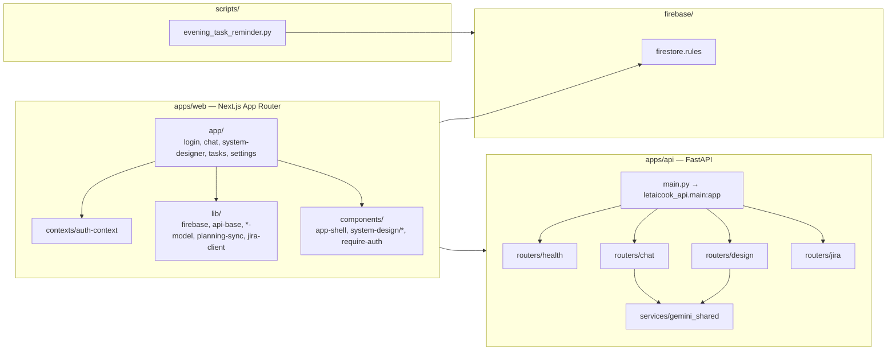

---

## 4. Actors & use cases (implemented)

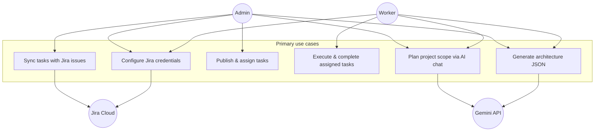

---

## 5. Firestore data model (class diagram)

Paths and types are defined in `apps/web/src/lib/*-model.ts` and enforced by `firebase/firestore.rules`.

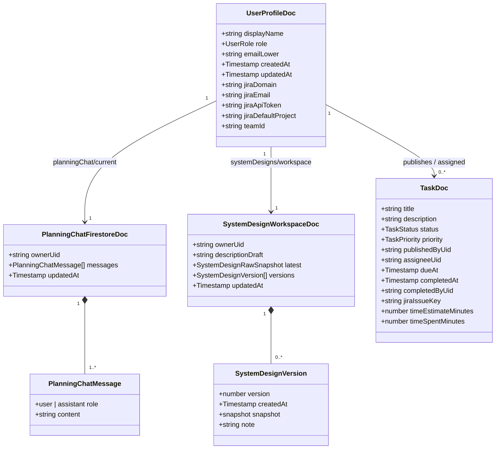

**Collection paths:**

| Path | Document id | Type source |
|------|-------------|-------------|
| `users/{uid}` | Auth uid | `user-model.ts` |
| `users/{uid}/planningChat/{docId}` | `current` | `planning-chat-model.ts` |
| `users/{uid}/systemDesigns/{docId}` | `workspace` | `system-design-model.ts` |
| `projects/{projectId}/tasks/{taskId}` | auto | `task-model.ts` (`DEMO_PROJECT_ID = demo-project`) |

---

## 6. Security rules (who can read/write)

```mermaid
flowchart TD
  A[Request with Firebase Auth token] --> B{Signed in?}
  B -->|no| DENY[Deny]
  B -->|yes| C{Resource path}

  C -->|users/uid| D{uid == auth.uid or admin?}
  D -->|read profile| OK
  D -->|create own profile| OK role worker or admin
  D -->|update| OK if admin OR own uid

  C -->|users/uid/planningChat/*| E{uid == auth.uid?}
  E -->|yes| OK

  C -->|users/uid/systemDesigns/*| E

  C -->|projects/*/tasks/*| F{admin?}
  F -->|yes| FULL[create read update delete]
  F -->|no worker| G{assigneeUid == auth.uid?}
  G -->|read update| OK
  G -->|create self-assigned| OK if publishedByUid also self
```

Server-side **Jira** and **Gemini** calls bypass Firestore rules (API holds secrets). The evening reminder script uses **Admin SDK** and is intended for a trusted machine only.

---

## 7. Authentication & profile lifecycle

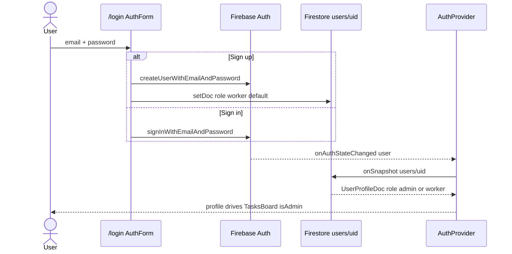

First **admin** is promoted manually in Firebase Console (`role: admin` on `users/{uid}`).

---

## 8. Planning chat flow (`/chat`)

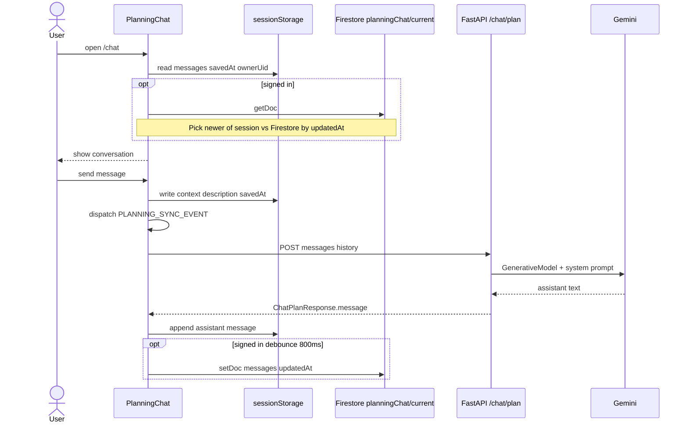

**Handoff to designer:** `planning-sync.ts` builds `letaicook_planning_project_description` from **user** messages only; full thread is in `letaicook_planning_context`.

---

## 9. Planning → System Designer handoff

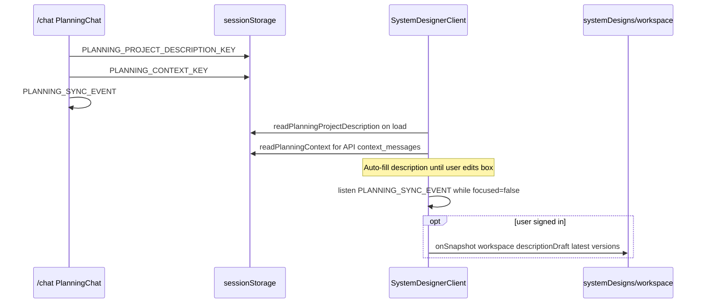

---

## 10. System designer generation (`/system-designer`)

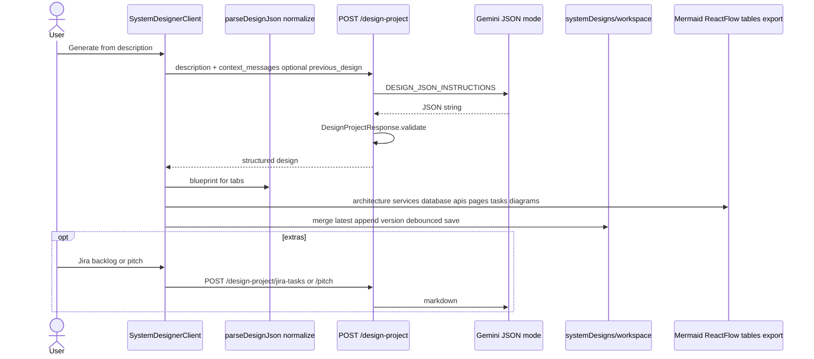

**UI tabs:** overview, architecture, services, database, apis, pages, tasks, diagrams.  
**Exports:** PNG / JSON / Markdown via `export-toolbar.tsx`.

---

## 11. Task board flow (`/tasks`)

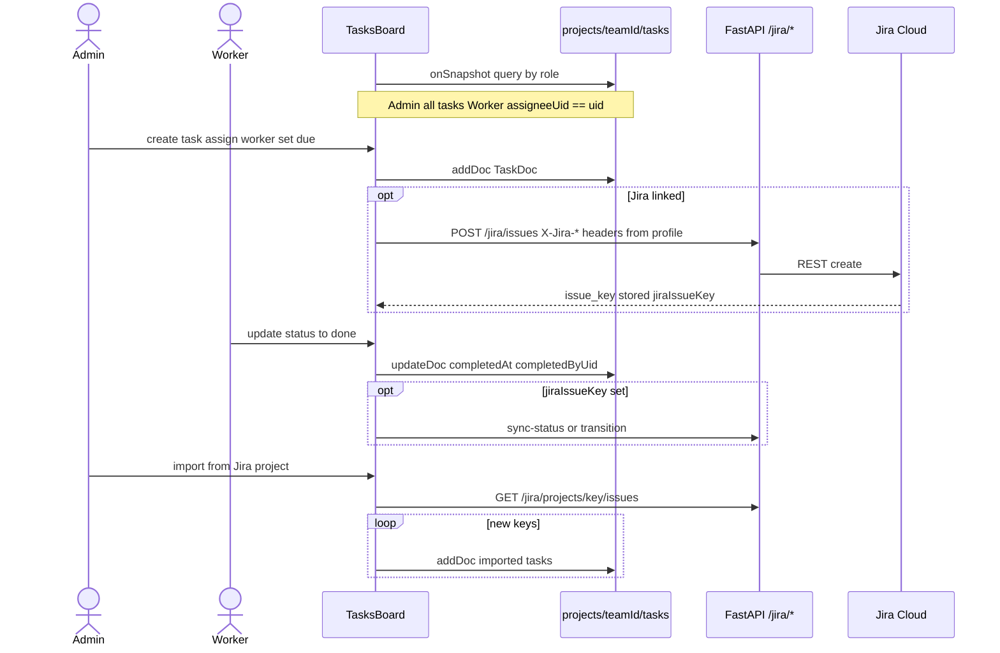

**Status values:** `todo` | `in_progress` | `review` | `done` | `blocked`.  
**Team id:** `profile.teamId` or `DEMO_PROJECT_ID`.

---

## 12. FastAPI surface (all routes)

```mermaid
classDiagram
  class FastAPIApp {
    +GET /health
  }
  class ChatRouter {
    +POST /chat/plan
  }
  class DesignRouter {
    +POST /design-project
    +POST /design-project/jira-tasks
    +POST /design-project/pitch
  }
  class JiraRouter {
    +GET /jira/config
    +POST /jira/config/test
    +GET /jira/projects
    +GET /jira/projects/{key}/issues
    +POST /jira/issues
    +GET /jira/issues/{key}
    +PUT /jira/issues/{key}
    +DELETE /jira/issues/{key}
    +POST /jira/issues/{key}/transition
    +POST /jira/issues/{key}/sync-status
    +POST /jira/issues/batch
  }
  class GeminiShared {
    +google_api_key()
    +plan_model_candidates()
    +generate_content_with_fallback()
  }

  FastAPIApp --> ChatRouter
  FastAPIApp --> DesignRouter
  FastAPIApp --> JiraRouter
  ChatRouter --> GeminiShared
  DesignRouter --> GeminiShared
```

**Jira credentials:** per-request headers `X-Jira-Domain`, `X-Jira-Email`, `X-Jira-Token`, `X-Jira-Project` (from user profile via `jira-client.ts`) or server env fallbacks.

---

## 13. Web app navigation & guards

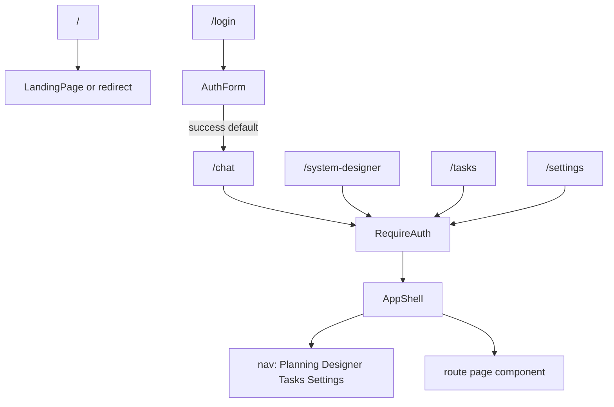

`AppProviders` wraps the tree with `AuthProvider` (`layout.tsx`).

---

## 14. API base URL resolution (browser → FastAPI)

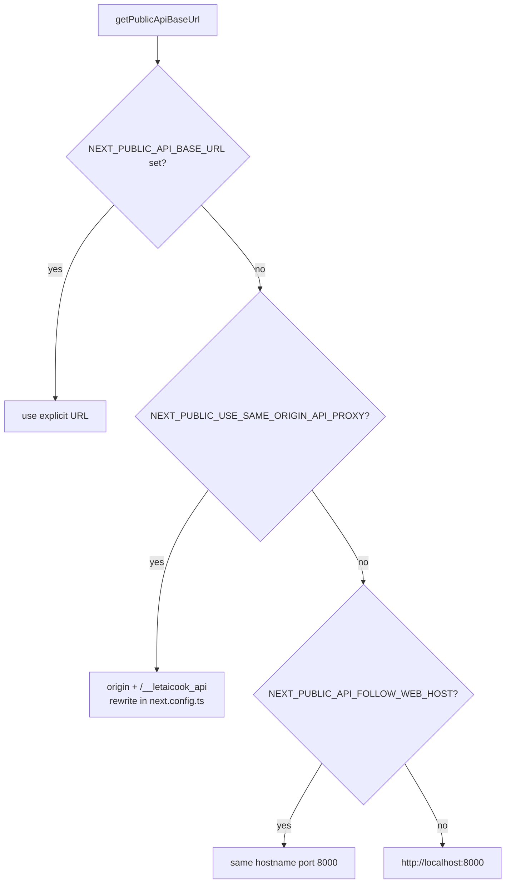

---

## 15. End-to-end “idea to tracked work” (combined)

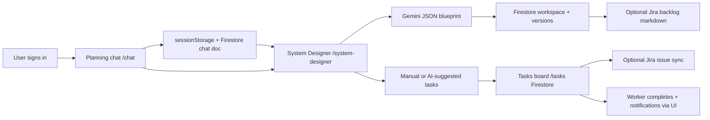

---

## 16. Key files reference

| Concern | Location |
|---------|----------|
| Product contract | `AI_PROJECT_INSTRUCTIONS.md` |
| Web entry & providers | `apps/web/src/app/layout.tsx`, `components/app-providers.tsx` |
| Auth | `apps/web/src/contexts/auth-context.tsx`, `app/login/` |
| Planning UI | `apps/web/src/app/chat/planning-chat.tsx` |
| Designer UI | `apps/web/src/app/system-designer/system-designer-client.tsx` |
| Tasks UI | `apps/web/src/app/tasks/tasks-board.tsx` |
| Firestore rules | `firebase/firestore.rules` |
| API app factory | `apps/api/letaicook_api/main.py` |
| Gemini shared | `apps/api/letaicook_api/services/gemini_shared.py` |
| Design normalization | `apps/web/src/lib/system-design/normalize.ts` |
| Evening reminder | `scripts/evening_task_reminder.py` |

---

## 17. How to view these diagrams

- **GitHub / GitLab:** Mermaid blocks render in the markdown preview.
- **VS Code / Cursor:** Markdown preview with Mermaid support, or paste a diagram into [mermaid.live](https://mermaid.live).
- **Export:** use mermaid-cli or the live editor to produce PNG/SVG for slides.

---

*Generated to match the repository as of 2026-05-19. When architecture changes, update this file in the same PR as code.*
